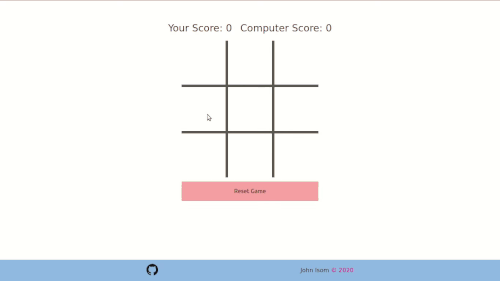

# Tic Tac Toe #

[Tic Tac Toe][tic-tac-toe-wiki] powered by Ruby and the [Sinatra][sinatra-site] framework. You play as player “x” against an intelligent computer. This app is hosted live at [this link][herokuapp].

I built this from scratch, with the exception of the Sinatra framework. Keep
in mind that this app is entirely server-based, so there is no JavaScript or
event handling. Instead, it uses a form with invisible buttons that send a
POST request to the server when an empty square is clicked.

## Example Usage ##

  

[tic-tac-toe-wiki]: https://en.wikipedia.org/wiki/Tic-tac-toe
[sinatra-site]: http://sinatrarb.com/
[herokuapp]: https://just-a-tic-tac-toe-app.herokuapp.com/
